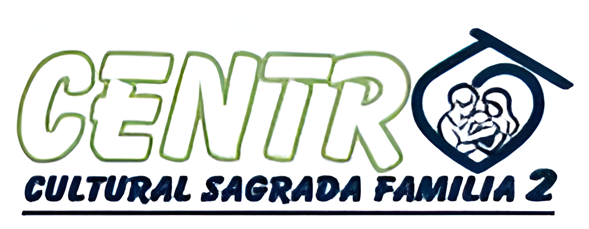

<a name="readme-top"></a>

<!-- SHIELDS -->
[![Contributors][contributors-shield]][contributors-url]
[![Forks][forks-shield]][forks-url]
[![Stargazers][stars-shield]][stars-url]
[![Issues][issues-shield]][issues-url]
[![License][license-shield]][license-url]
[![LinkedIn][linkedin-shield]][linkedin-url]

<!-- LOGO -->
<br />
<div align="center">
  <a href="https://github.com/DerNait/sistema-cc-sagrada-familia-2">
    
  </a>

  <h3 align="center">Gestión para Centro Cultural Sagrada Familia 2</h3>

  <p align="center">
    Proyecto Laravel + Vue 3 + Docker para la gestión de un centro cultural.
    <br />
    <a href="https://github.com/DerNait/sistema-cc-sagrada-familia-2"><strong>Documentación »</strong></a>
    <br />
    <br />
    <!-- <a href="https://github.com/DerNait/sistema-cc-sagrada-familia-2">Ver Demo</a> -->
    ·
    <a href="https://github.com/DerNait/sistema-cc-sagrada-familia-2/issues">Reportar un Bug</a>
    ·
    <a href="https://github.com/DerNait/sistema-cc-sagrada-familia-2/issues">Solicitar una Funcionalidad</a>
  </p>
</div>

---

## 📋 Tabla de Contenidos

- [Acerca del Proyecto](#acerca-del-proyecto)
  - [Tecnologías Utilizadas](#tecnologías-utilizadas)
- [Comenzando](#comenzando)
  - [Requisitos](#requisitos)
  - [Instalación](#instalación)
- [Uso](#uso)
- [Roadmap](#roadmap)
- [Contribuyendo](#contribuyendo)
- [Licencia](#licencia)
- [Contacto](#contacto)
- [Agradecimientos](#agradecimientos)

---

## Acerca del Proyecto

Este proyecto busca facilitar la gestión operativa y administrativa del Centro Cultural Sagrada Familia. Utiliza una arquitectura moderna basada en contenedores Docker con Laravel 12, Vue 3 y PostgreSQL.

<p align="right">(<a href="#readme-top">volver arriba</a>)</p>

---

### Tecnologías Utilizadas

* ![Laravel][Laravel.com]
* ![Vue][Vue.js]
* ![Docker][Docker.com]
* ![PostgreSQL][PostgreSQL-url]

<p align="right">(<a href="#readme-top">volver arriba</a>)</p>

---

## Comenzando

### Requisitos

- [Docker](https://www.docker.com/products/docker-desktop)
- [Docker Compose](https://docs.docker.com/compose/)
- (Opcional) Make o Bash para ejecutar comandos fácilmente

### Instalación

1. Cloná el repositorio:
   ```bash
   git clone https://github.com/DerNait/sistema-cc-sagrada-familia-2.git
   cd sistema-cc-sagrada-familia-2
   ```

2. Copiá los archivos de entorno:
   ```bash
   cp .env.example .env
   cp docker-compose.yml.example docker-compose.yml
   cp docker-compose.override.yml.example docker-compose.override.yml
   ```

3. Ajustá valores en `.env` según tu necesidad (`APP_NAME`, `DB_DATABASE`, etc).

4. Levantá el proyecto:
   ```bash
   docker compose up --build
   ```

<p align="right">(<a href="#readme-top">volver arriba</a>)</p>

---

## Uso

Una vez levantado, accedé a:

- Laravel backend: http://localhost:8080  
- Vite frontend (Vue): http://localhost:5173  
- PostgreSQL: localhost:5434  

Acceso al contenedor de la app:

```bash
docker compose exec app bash
```

Comandos útiles dentro del contenedor:

```bash
php artisan migrate
php artisan db:seed
php artisan key:generate
```

<p align="right">(<a href="#readme-top">volver arriba</a>)</p>

---

## Roadmap

- [x] Backend con Laravel funcional
- [x] Frontend con Vue y Vite
- [x] Base de datos PostgreSQL lista
- [x] Contenedores Docker para cada componente
- [x] Autenticación de usuarios
- [ ] Gestión de actividades del centro
- [ ] Sistema de reportes exportables

<p align="right">(<a href="#readme-top">volver arriba</a>)</p>

---

## Contribuyendo

Las contribuciones son bienvenidas ✨

1. Fork del proyecto
2. Creá una nueva rama (`git checkout -b feature/nueva-funcionalidad`)
3. Commit (`git commit -m 'Agrego nueva funcionalidad'`)
4. Push (`git push origin feature/nueva-funcionalidad`)
5. Abrí un Pull Request

<p align="right">(<a href="#readme-top">volver arriba</a>)</p>

---

## Licencia

Distribuido bajo la licencia MIT. Ver `LICENSE.txt` para más detalles.

<p align="right">(<a href="#readme-top">volver arriba</a>)</p>

---

## Contacto

Kevin Villagrán - [@dernait](https://discordapp.com/users/345410508783878144)  
Repositorio: [https://github.com/DerNait/sistema-cc-sagrada-familia-2](https://github.com/DerNait/sistema-cc-sagrada-familia-2)

<p align="right">(<a href="#readme-top">volver arriba</a>)</p>

---

## Agradecimientos

- Plantilla original: [othneildrew/Best-README-Template](https://github.com/othneildrew/Best-README-Template)
- Laravel, Vue y Docker por ser herramientas tan poderosas y flexibles

<p align="right">(<a href="#readme-top">volver arriba</a>)</p>

<!-- MARKDOWN LINKS & IMAGES -->
[contributors-shield]: https://img.shields.io/github/contributors/DerNait/sistema-cc-sagrada-familia-2.svg?style=for-the-badge
[contributors-url]: https://github.com/DerNait/sistema-cc-sagrada-familia-2/graphs/contributors
[forks-shield]: https://img.shields.io/github/forks/DerNait/sistema-cc-sagrada-familia-2.svg?style=for-the-badge
[forks-url]: https://github.com/DerNait/sistema-cc-sagrada-familia-2/network/members
[stars-shield]: https://img.shields.io/github/stars/DerNait/sistema-cc-sagrada-familia-2.svg?style=for-the-badge
[stars-url]: https://github.com/DerNait/sistema-cc-sagrada-familia-2/stargazers
[issues-shield]: https://img.shields.io/github/issues/DerNait/sistema-cc-sagrada-familia-2.svg?style=for-the-badge
[issues-url]: https://github.com/DerNait/sistema-cc-sagrada-familia-2/issues
[license-shield]: https://img.shields.io/github/license/DerNait/sistema-cc-sagrada-familia-2.svg?style=for-the-badge
[license-url]: https://github.com/DerNait/sistema-cc-sagrada-familia-2/LICENSE.txt
[linkedin-shield]: https://img.shields.io/badge/-LinkedIn-black.svg?style=for-the-badge&logo=linkedin&colorB=555
[linkedin-url]: https://linkedin.com/in/tu_linkedin
[Laravel.com]: https://img.shields.io/badge/Laravel-FF2D20?style=for-the-badge&logo=laravel&logoColor=white
[Vue.js]: https://img.shields.io/badge/Vue.js-35495E?style=for-the-badge&logo=vuedotjs&logoColor=4FC08D
[Docker.com]: https://img.shields.io/badge/Docker-2496ED?style=for-the-badge&logo=docker&logoColor=white
[PostgreSQL-url]: https://img.shields.io/badge/PostgreSQL-336791?style=for-the-badge&logo=postgresql&logoColor=white
